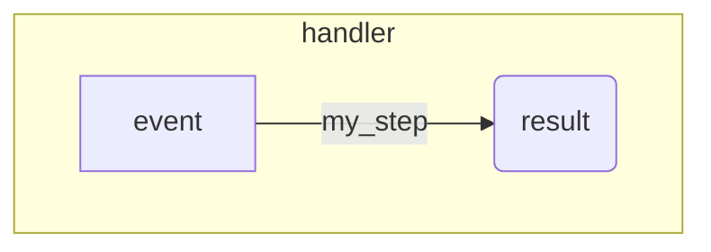

# schema
Python schema parser to mermaid diagram using [tree-sitter](https://tree-sitter.github.io/tree-sitter/index.html).

## motivation
`schema` aims to render workflow-like code composed via decorated functions as a [DAG](https://en.wikipedia.org/wiki/Directed_acyclic_graph) to visualize application logic.

For example consider the [durable lambda functions sdk](https://docs.aws.amazon.com/lambda/latest/dg/durable-basic-concepts.html):

```python 
@durable_step
def my_step(step_context, data):
    pass


@durable_execution
def handler(event, context: DurableContext):
    result = context.step(my_step(event["data"]))
    return result
```

Graphically the flow looks like:



Ideally this diagram would be rendered _fast_ and _automatically_ without needing additional dependencies in the code.

# tree-sitter


## todo
- [ ] node parsing and hierarchy resolving with tree-sitter 
- [ ] diagram rendering with [`mmdr`](https://github.com/1jehuang/mermaid-rs-renderer) in ascii and svg
- [ ] clap cli
- [ ] optimizations (concurrency(?) mmemap, etc)
- [ ] maturin bindings
- [ ] tests
